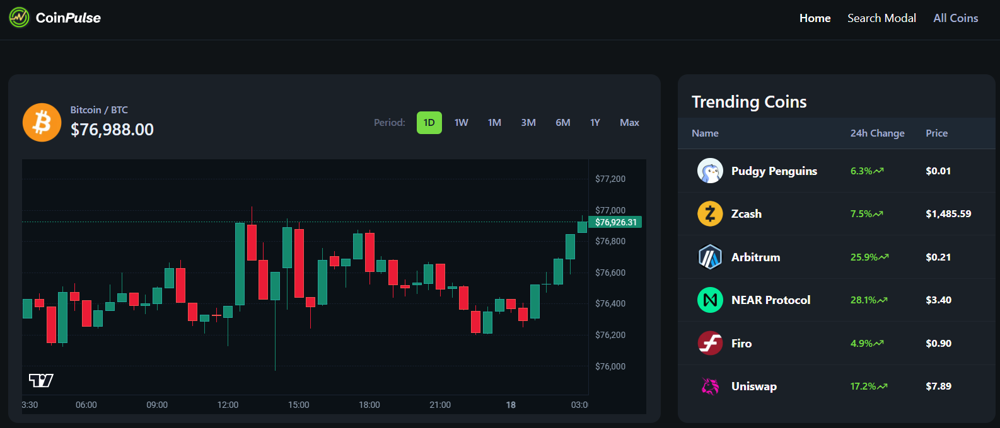

# CryptoApp

A cryptocurrency market analytics dashboard built with Next.js. Displays real-time cryptocurrency prices, market data, and historical information from the CoinGecko API.



## Features

- **Market Overview**: Browse cryptocurrencies sorted by market capitalization
- **Search**: Real-time search across the entire CoinGecko database
- **Filtering**: Filter coins by top gainers, top losers, highest/lowest price
- **Trending Coins**: Live list of top trending cryptocurrencies
- **Coin Details**: Detailed view with price, market statistics, and historical data
- **Interactive Candlestick Chart**: Multi-timeframe OHLCV price charts
- **Real-Time Orderbook & Trades**: Live buy/sell order and trade feed via WebSocket
- **Currency Converter**: Convert coin amounts across supported fiat and crypto currencies
- **Dark Mode Support**: Theme-aware styling throughout the app

## Architecture

The app follows a modular, component-driven structure with clear separation of concerns:

- **Pages**: Route-level pages and layouts (`app/`)
- **Components**: Reusable UI building blocks, including `shadcn/ui`-based components
- **Hooks**: Custom React hooks for data fetching and WebSocket subscriptions
- **Lib**: Shared utilities and API client logic
- **Constants**: App-wide constants and configuration (`constants.ts`)
- **Types**: Shared TypeScript type definitions (`type.d.ts`)

## Technical Stack

- **Language**: TypeScript
- **Framework**: Next.js
- **Styling**: Tailwind CSS with `shadcn/ui` components
- **Charts**: TradingView Lightweight Charts
- **API**: CoinGecko API (REST + WebSocket)
- **Linting/Formatting**: ESLint, Prettier

## Project Structure

```
CryptoApp/
├── app/                 # Routes, pages, and layouts
├── components/          # Reusable UI components
├── hooks/               # Custom React hooks
├── lib/                 # Utilities and API client logic
├── public/              # Static assets
├── constants.ts         # App-wide constants
├── type.d.ts            # Shared TypeScript types
├── next.config.ts       # Next.js configuration
└── tsconfig.json        # TypeScript configuration
```

## API Integration

The app integrates with CoinGecko's API:

- `/global` - Global market statistics
- `/search/trending` - Trending tokens
- `/coins/markets` - Market data for listing and sorting coins
- `/coins/{id}` - Core token detail data
- `/coins/{id}/market_chart` - Historical price, market cap, and volume data
- `/search` - Search coins by name or symbol
- `/simple/price` and `/simple/supported_vs_currencies` - Currency conversion
- `/exchanges` and `/exchanges/{id}/tickers` - Exchange and trading pair data

All real-time updates (price ticks, orderbook, and trades) are delivered over WebSocket connections rather than polling.

## Key Components

- **HeaderCard**: Card displaying global stats and trending coin information
- **CoinTable / CoinRowView**: List/table item showing coin name, symbol, price, and 24h change
- **CandlestickChart**: TradingView-powered chart for OHLCV visualization
- **OrderbookFeed**: Live orderbook and trade stream component
- **CoinDetailView**: Comprehensive detail view with market statistics

## Testing

Tests are provided for:

- API client and data-fetching utilities (`api.test.ts`)
- Formatting helpers for prices and percentages (`formatters.test.ts`)
- Core UI components (`components.test.ts`)

## Requirements

- Node.js 18 or later
- npm 9 or later

## License

Copyright (c) 2026 Daniel Zou
